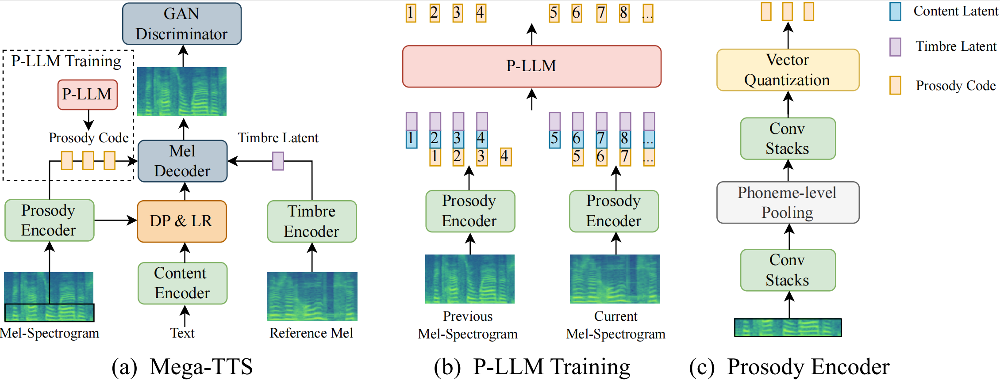

# Mega-TTS
# Zero-Shot Text-to-Speech at Scale with Intrinsic Inductive Bias

## Abstract
Scaling text-to-speech to a large and wild dataset has been proven to be highly effective in achieving timbre and speech style generalization, particularly in zero-shot TTS. However, previous works usually encode speech into latent using audio codec and use autoregressive language models or diffusion models to generate it, which ignores the intrinsic nature of speech and may lead to inferior or uncontrollable results. We argue that speech can be decomposed into several attributes (e.g., content, timbre, prosody, and phase) and each of them should be modeled using a module with appropriate inductive biases. From this perspective, we carefully design a novel and large zero-shot TTS system called Mega-TTS, which is trained with large-scale wild data and models different attributes in different ways: 1) Instead of using latent encoded by audio codec as the intermediate feature, we still choose spectrogram as it separates the phase and other attributes very well. Phase can be appropriately constructed by the GAN-based vocoder and does not need to be modeled by the language model. 2) We model the timbre using global vectors since timbre is a global attribute that changes slowly over time. 3) We further use a VQGAN-based acoustic model to generate the spectrogram and a latent code language model to fit the distribution of prosody, since prosody changes quickly over time in a sentence, and language models can capture both local and long-range dependencies. We scale Mega-TTS to multi-domain datasets with 20K hours of speech and evaluate its performance on unseen speakers. Experimental results demonstrate that Mega-TTS surpasses state-of-the-art TTS systems on zero-shot TTS, speech editing, and cross-lingual TTS tasks, with superior naturalness, robustness, and speaker similarity due to the proper inductive bias of each module.

[*] This page is for <strong>research demonstration purposes</strong> only.

<h2> Zero-Shot TTS Samples </h2>
<table border="0" width="100%">
  <thead>
    <tr>
      <th align="center"><strong>Text</strong></th>
      <th align="center"><strong>Speaker Prompt</strong></th>
      <th align="center"><strong>Ground Truth</strong></th>
      <th align="center"><strong>YourTTS</strong></th>
      <th align="center"><strong>VALL-E</strong></th>
      <th align="center"><strong>Mega-TTS</strong></th>
    </tr>
  </thead>
  <tbody>
    <tr>
      <td width="40%">
He was in deep converse with the clerk and entered the hall holding him by the arm.
</td>
      <td width="12%" style="text-align: center;"><audio controls="" ><source src="audio_sample/zero-shot_TTS/prompt/4.wav" type="audio/wav"></audio></td>
      <td width="12%" style="text-align: center;"><audio controls="" ><source src="audio_sample/zero-shot_TTS/gt/4.wav" type="audio/wav"></audio></td>
      <td width="12%" style="text-align: center;"><audio controls="" ><source src="audio_sample/zero-shot_TTS/yourtts/4.wav" type="audio/wav"></audio></td>
      <td width="12%" style="text-align: center;"><audio controls="" ><source src="audio_sample/zero-shot_TTS/valle/4.wav" type="audio/wav"></audio></td>
      <td width="12%" style="text-align: center;"><audio controls="" ><source src="audio_sample/zero-shot_TTS/mega-tts/4.wav" type="audio/wav"></audio></td>
    </tr>
    <tr>
      <td width="40%">
Yea, his honourable worship is within, but he hath a godly minister or two with him, and likewise a leech.
</td>
      <td width="12%" style="text-align: center;"><audio controls="" ><source src="audio_sample/zero-shot_TTS/prompt/1.wav" type="audio/wav"></audio></td>
      <td width="12%" style="text-align: center;"><audio controls="" ><source src="audio_sample/zero-shot_TTS/gt/1.wav" type="audio/wav"></audio></td>
      <td width="12%" style="text-align: center;"><audio controls="" ><source src="audio_sample/zero-shot_TTS/yourtts/1.wav" type="audio/wav"></audio></td>
      <td width="12%" style="text-align: center;"><audio controls="" ><source src="audio_sample/zero-shot_TTS/valle/1.wav" type="audio/wav"></audio></td>
      <td width="12%" style="text-align: center;"><audio controls="" ><source src="audio_sample/zero-shot_TTS/mega-tts/1.wav" type="audio/wav"></audio></td>
    </tr>
    <tr>
      <td width="40%">
Instead of shoes, the old man wore boots with turnover tops, and his blue coat had wide cuffs of gold braid.
</td>
      <td width="12%" style="text-align: center;"><audio controls="" ><source src="audio_sample/zero-shot_TTS/prompt/2.wav" type="audio/wav"></audio></td>
      <td width="12%" style="text-align: center;"><audio controls="" ><source src="audio_sample/zero-shot_TTS/gt/2.wav" type="audio/wav"></audio></td>
      <td width="12%" style="text-align: center;"><audio controls="" ><source src="audio_sample/zero-shot_TTS/yourtts/2.wav" type="audio/wav"></audio></td>
      <td width="12%" style="text-align: center;"><audio controls="" ><source src="audio_sample/zero-shot_TTS/valle/2.wav" type="audio/wav"></audio></td>
      <td width="12%" style="text-align: center;"><audio controls="" ><source src="audio_sample/zero-shot_TTS/mega-tts/2.wav" type="audio/wav"></audio></td>
    </tr>
    <tr>
      <td width="40%">
The army found the people in poverty and left them in comparative wealth.
</td>
      <td width="12%" style="text-align: center;"><audio controls="" ><source src="audio_sample/zero-shot_TTS/prompt/3.wav" type="audio/wav"></audio></td>
      <td width="12%" style="text-align: center;"><audio controls="" ><source src="audio_sample/zero-shot_TTS/gt/3.wav" type="audio/wav"></audio></td>
      <td width="12%" style="text-align: center;"><audio controls="" ><source src="audio_sample/zero-shot_TTS/yourtts/3.wav" type="audio/wav"></audio></td>
      <td width="12%" style="text-align: center;"><audio controls="" ><source src="audio_sample/zero-shot_TTS/valle/3.wav" type="audio/wav"></audio></td>
      <td width="12%" style="text-align: center;"><audio controls="" ><source src="audio_sample/zero-shot_TTS/mega-tts/3.wav" type="audio/wav"></audio></td>
    </tr>
    <tr>
      <td width="40%">
So what is the campaign about?
</td>
      <td width="12%" style="text-align: center;"><audio controls="" ><source src="audio_sample/zero-shot_TTS/prompt/5.wav" type="audio/wav"></audio></td>
      <td width="12%" style="text-align: center;"><audio controls="" ><source src="audio_sample/zero-shot_TTS/gt/5.wav" type="audio/wav"></audio></td>
      <td width="12%" style="text-align: center;"><audio controls="" ><source src="audio_sample/zero-shot_TTS/yourtts/5.wav" type="audio/wav"></audio></td>
      <td width="12%" style="text-align: center;"><audio controls="" ><source src="audio_sample/zero-shot_TTS/valle/5.wav" type="audio/wav"></audio></td>
      <td width="12%" style="text-align: center;"><audio controls="" ><source src="audio_sample/zero-shot_TTS/mega-tts/5.wav" type="audio/wav"></audio></td>
    </tr>
    <tr>
      <td width="40%">
Nothing is yet confirmed.
</td>
      <td width="12%" style="text-align: center;"><audio controls="" ><source src="audio_sample/zero-shot_TTS/prompt/6.wav" type="audio/wav"></audio></td>
      <td width="12%" style="text-align: center;"><audio controls="" ><source src="audio_sample/zero-shot_TTS/gt/6.wav" type="audio/wav"></audio></td>
      <td width="12%" style="text-align: center;"><audio controls="" ><source src="audio_sample/zero-shot_TTS/yourtts/6.wav" type="audio/wav"></audio></td>
      <td width="12%" style="text-align: center;"><audio controls="" ><source src="audio_sample/zero-shot_TTS/valle/6.wav" type="audio/wav"></audio></td>
      <td width="12%" style="text-align: center;"><audio controls="" ><source src="audio_sample/zero-shot_TTS/mega-tts/6.wav" type="audio/wav"></audio></td>
    </tr>
    <tr>
      <td width="40%">
Her husband was very concerned that it might be fatal.
</td>
      <td width="12%" style="text-align: center;"><audio controls="" ><source src="audio_sample/zero-shot_TTS/prompt/7.wav" type="audio/wav"></audio></td>
      <td width="12%" style="text-align: center;"><audio controls="" ><source src="audio_sample/zero-shot_TTS/gt/7.wav" type="audio/wav"></audio></td>
      <td width="12%" style="text-align: center;"><audio controls="" ><source src="audio_sample/zero-shot_TTS/yourtts/7.wav" type="audio/wav"></audio></td>
      <td width="12%" style="text-align: center;"><audio controls="" ><source src="audio_sample/zero-shot_TTS/valle/7.wav" type="audio/wav"></audio></td>
      <td width="12%" style="text-align: center;"><audio controls="" ><source src="audio_sample/zero-shot_TTS/mega-tts/7.wav" type="audio/wav"></audio></td>
    </tr>
    <tr>
      <td width="40%">
We've made a couple of albums.
</td>
      <td width="12%" style="text-align: center;"><audio controls="" ><source src="audio_sample/zero-shot_TTS/prompt/8.wav" type="audio/wav"></audio></td>
      <td width="12%" style="text-align: center;"><audio controls="" ><source src="audio_sample/zero-shot_TTS/gt/8.wav" type="audio/wav"></audio></td>
      <td width="12%" style="text-align: center;"><audio controls="" ><source src="audio_sample/zero-shot_TTS/yourtts/8.wav" type="audio/wav"></audio></td>
      <td width="12%" style="text-align: center;"><audio controls="" ><source src="audio_sample/zero-shot_TTS/valle/8.wav" type="audio/wav"></audio></td>
      <td width="12%" style="text-align: center;"><audio controls="" ><source src="audio_sample/zero-shot_TTS/mega-tts/8.wav" type="audio/wav"></audio></td>
    </tr>
  </tbody>
</table>  

<h2> Speech Editing Samples </h2>
<table border="0" width="100%">
  <thead>
    <tr>
      <th align="center"><strong>Text</strong></th>
      <th align="center"><strong>Original Speech</strong></th>
      <th align="center"><strong>Editspeech</strong></th>
      <th align="center"><strong>A3T</strong></th>
      <th align="center"><strong>Mega-TTS</strong></th>
    </tr>
  </thead>
  <tbody>
    <tr>
      <td width="60%">
However, there is <strong>an issue</strong>, isn't there? --> However, there is <strong>an obvious issue</strong>, isnt there?
</td>
      <td width="10%" style="text-align: center;"><audio controls="" ><source src="audio_sample/speech_editing/gt/1.wav" type="audio/wav"></audio></td>
      <td width="10%" style="text-align: center;"><audio controls="" ><source src="audio_sample/speech_editing/editspeech/1.wav" type="audio/wav"></audio></td>
      <td width="10%" style="text-align: center;"><audio controls="" ><source src="audio_sample/speech_editing/a3t/1.wav" type="audio/wav"></audio></td>
      <td width="10%" style="text-align: center;"><audio controls="" ><source src="audio_sample/speech_editing/mega-tts/1.wav" type="audio/wav"></audio></td>
    </tr>
    <tr>
      <td width="60%">
Others have tried to explain <strong>the phenomenon</strong> physically. --> Others have tried to explain <strong>the rare phenomenon for them</strong> physically.
</td>
      <td width="10%" style="text-align: center;"><audio controls="" ><source src="audio_sample/speech_editing/gt/2.wav" type="audio/wav"></audio></td>
      <td width="10%" style="text-align: center;"><audio controls="" ><source src="audio_sample/speech_editing/editspeech/2.wav" type="audio/wav"></audio></td>
      <td width="10%" style="text-align: center;"><audio controls="" ><source src="audio_sample/speech_editing/a3t/2.wav" type="audio/wav"></audio></td>
      <td width="10%" style="text-align: center;"><audio controls="" ><source src="audio_sample/speech_editing/mega-tts/2.wav" type="audio/wav"></audio></td>
    </tr>
    <tr>
      <td width="60%">
Well, he <strong>can</strong> do it. --> Well, he <strong>is able to</strong> do it.
</td>
      <td width="10%" style="text-align: center;"><audio controls="" ><source src="audio_sample/speech_editing/gt/3.wav" type="audio/wav"></audio></td>
      <td width="10%" style="text-align: center;"><audio controls="" ><source src="audio_sample/speech_editing/editspeech/3.wav" type="audio/wav"></audio></td>
      <td width="10%" style="text-align: center;"><audio controls="" ><source src="audio_sample/speech_editing/a3t/3.wav" type="audio/wav"></audio></td>
      <td width="10%" style="text-align: center;"><audio controls="" ><source src="audio_sample/speech_editing/mega-tts/3.wav" type="audio/wav"></audio></td>
    </tr>
    <tr>
      <td width="60%">
Throughout the centuries people have <strong>explained the rainbow</strong> in various ways. --> Throughout the centuries people have <strong>constantly explained the rainbow phenomenon</strong> in various ways.
</td>
      <td width="10%" style="text-align: center;"><audio controls="" ><source src="audio_sample/speech_editing/gt/4.wav" type="audio/wav"></audio></td>
      <td width="10%" style="text-align: center;"><audio controls="" ><source src="audio_sample/speech_editing/editspeech/4.wav" type="audio/wav"></audio></td>
      <td width="10%" style="text-align: center;"><audio controls="" ><source src="audio_sample/speech_editing/a3t/4.wav" type="audio/wav"></audio></td>
      <td width="10%" style="text-align: center;"><audio controls="" ><source src="audio_sample/speech_editing/mega-tts/4.wav" type="audio/wav"></audio></td>
    </tr>
    <tr>
      <td width="60%">
She has nothing to <strong>say to</strong> journalists. --> She has nothing to <strong>communicate with</strong> journalists.
</td>
      <td width="10%" style="text-align: center;"><audio controls="" ><source src="audio_sample/speech_editing/gt/5.wav" type="audio/wav"></audio></td>
      <td width="10%" style="text-align: center;"><audio controls="" ><source src="audio_sample/speech_editing/editspeech/5.wav" type="audio/wav"></audio></td>
      <td width="10%" style="text-align: center;"><audio controls="" ><source src="audio_sample/speech_editing/a3t/5.wav" type="audio/wav"></audio></td>
      <td width="10%" style="text-align: center;"><audio controls="" ><source src="audio_sample/speech_editing/mega-tts/5.wav" type="audio/wav"></audio></td>
    </tr>
    <tr>
      <td width="60%">
I am confident of <strong>the outcome</strong> this week. --> I am confident of <strong>the midsemester outcome at</strong> this week.
</td>
      <td width="10%" style="text-align: center;"><audio controls="" ><source src="audio_sample/speech_editing/gt/6.wav" type="audio/wav"></audio></td>
      <td width="10%" style="text-align: center;"><audio controls="" ><source src="audio_sample/speech_editing/editspeech/6.wav" type="audio/wav"></audio></td>
      <td width="10%" style="text-align: center;"><audio controls="" ><source src="audio_sample/speech_editing/a3t/6.wav" type="audio/wav"></audio></td>
      <td width="10%" style="text-align: center;"><audio controls="" ><source src="audio_sample/speech_editing/mega-tts/6.wav" type="audio/wav"></audio></td>
    </tr>
    <tr>
      <td width="60%">
Something <strong>happened</strong> on that island. --> Something <strong>wrong suddenly happened</strong> on that island.
</td>
      <td width="10%" style="text-align: center;"><audio controls="" ><source src="audio_sample/speech_editing/gt/7.wav" type="audio/wav"></audio></td>
      <td width="10%" style="text-align: center;"><audio controls="" ><source src="audio_sample/speech_editing/editspeech/7.wav" type="audio/wav"></audio></td>
      <td width="10%" style="text-align: center;"><audio controls="" ><source src="audio_sample/speech_editing/a3t/7.wav" type="audio/wav"></audio></td>
      <td width="10%" style="text-align: center;"><audio controls="" ><source src="audio_sample/speech_editing/mega-tts/7.wav" type="audio/wav"></audio></td>
    </tr>
    <tr>
      <td width="60%">
You probably <strong>have never seen</strong> them before. --> You probably <strong>have worked with</strong> them before.
</td>
      <td width="10%" style="text-align: center;"><audio controls="" ><source src="audio_sample/speech_editing/gt/8.wav" type="audio/wav"></audio></td>
      <td width="10%" style="text-align: center;"><audio controls="" ><source src="audio_sample/speech_editing/editspeech/8.wav" type="audio/wav"></audio></td>
      <td width="10%" style="text-align: center;"><audio controls="" ><source src="audio_sample/speech_editing/a3t/8.wav" type="audio/wav"></audio></td>
      <td width="10%" style="text-align: center;"><audio controls="" ><source src="audio_sample/speech_editing/mega-tts/8.wav" type="audio/wav"></audio></td>
    </tr>
  </tbody>
</table>

<h2> Cross-Lingual TTS Samples </h2>
<table border="0" width="100%">
  <thead>
    <tr>
      <th align="center"><strong>English Text</strong></th>
      <th align="center"><strong>Chinese Speaker Prompt</strong></th>
      <th align="center"><strong>YourTTS</strong></th>
      <th align="center"><strong>VALL-E X</strong></th>
      <th align="center"><strong>Mega-TTS</strong></th>
    </tr>
  </thead>
  <tbody>
    <tr>
      <td width="40%">
He honours whatever he recognizes in himself, such morality equals self-glorification.
</td>
      <td width="15%" style="text-align: center;"><audio controls="" ><source src="audio_sample/cross-lingual_TTS/prompt_chinese/1.wav" type="audio/wav"></audio></td>
      <td width="15%" style="text-align: center;"><audio controls="" ><source src="audio_sample/cross-lingual_TTS/yourtts_english/1.wav" type="audio/wav"></audio></td>
      <td width="15%" style="text-align: center;"><audio controls="" ><source src="audio_sample/cross-lingual_TTS/vallex_english/1.wav" type="audio/wav"></audio></td>
      <td width="15%" style="text-align: center;"><audio controls="" ><source src="audio_sample/cross-lingual_TTS/mega-tts_english/1.wav" type="audio/wav"></audio></td>
    </tr>
    <tr>
      <td width="40%">
There could be little art in this last and final round of fencing.
</td>
      <td width="15%" style="text-align: center;"><audio controls="" ><source src="audio_sample/cross-lingual_TTS/prompt_chinese/2.wav" type="audio/wav"></audio></td>
      <td width="15%" style="text-align: center;"><audio controls="" ><source src="audio_sample/cross-lingual_TTS/yourtts_english/2.wav" type="audio/wav"></audio></td>
      <td width="15%" style="text-align: center;"><audio controls="" ><source src="audio_sample/cross-lingual_TTS/vallex_english/2.wav" type="audio/wav"></audio></td>
      <td width="15%" style="text-align: center;"><audio controls="" ><source src="audio_sample/cross-lingual_TTS/mega-tts_english/2.wav" type="audio/wav"></audio></td>
    </tr>
    <tr>
      <td width="40%">
It's the first time Hilda has been to our house and Tom introduces her around.
</td>
      <td width="15%" style="text-align: center;"><audio controls="" ><source src="audio_sample/cross-lingual_TTS/prompt_chinese/3.wav" type="audio/wav"></audio></td>
      <td width="15%" style="text-align: center;"><audio controls="" ><source src="audio_sample/cross-lingual_TTS/yourtts_english/3.wav" type="audio/wav"></audio></td>
      <td width="15%" style="text-align: center;"><audio controls="" ><source src="audio_sample/cross-lingual_TTS/vallex_english/3.wav" type="audio/wav"></audio></td>
      <td width="15%" style="text-align: center;"><audio controls="" ><source src="audio_sample/cross-lingual_TTS/mega-tts_english/3.wav" type="audio/wav"></audio></td>
    </tr>
    <tr>
      <td width="40%">
It was youth and poverty and proximity and everything was young and kindly.
</td>
      <td width="15%" style="text-align: center;"><audio controls="" ><source src="audio_sample/cross-lingual_TTS/prompt_chinese/4.wav" type="audio/wav"></audio></td>
      <td width="15%" style="text-align: center;"><audio controls="" ><source src="audio_sample/cross-lingual_TTS/yourtts_english/4.wav" type="audio/wav"></audio></td>
      <td width="15%" style="text-align: center;"><audio controls="" ><source src="audio_sample/cross-lingual_TTS/vallex_english/4.wav" type="audio/wav"></audio></td>
      <td width="15%" style="text-align: center;"><audio controls="" ><source src="audio_sample/cross-lingual_TTS/mega-tts_english/4.wav" type="audio/wav"></audio></td>
    </tr>
  </tbody>
</table> 

<h2> Robustness Test Samples </h2>
<table border="0" width="100%">
  <thead>
    <tr>
      <th align="center"><strong>Text</strong></th>
      <th align="center"><strong>Tacotron</strong></th>
      <th align="center"><strong>Mega-TTS</strong></th>
    </tr>
  </thead>
  <tbody>
    <tr>
      <td width="50%">
See owned a saw and Mr Soar owned a seesaw. Now See’s saw sawed Soar’s seesaw before Soar saw See.
</td>
      <td width="25%" style="text-align: center;"><audio controls="" ><source src="audio_sample/robustness_test/tacotron/1.wav" type="audio/wav"></audio></td>
      <td width="25%" style="text-align: center;"><audio controls="" ><source src="audio_sample/robustness_test/mega-tts/1.wav" type="audio/wav"></audio></td>
    </tr>
    <tr>
      <td width="50%">
forty one to five three hundred and eleven Fail - one - one to zero two Cancelled - zero - zero to zero zero Total.
</td>
      <td width="25%" style="text-align: center;"><audio controls="" ><source src="audio_sample/robustness_test/tacotron/13.wav" type="audio/wav"></audio></td>
      <td width="25%" style="text-align: center;"><audio controls="" ><source src="audio_sample/robustness_test/mega-tts/13.wav" type="audio/wav"></audio></td>
    </tr>
    <tr>
      <td width="50%">
Thursday, via a joint press release and Microsoft speech Blog, we will announce Microsoft’s continued partnership with Shell leveraging cloud, speech, and collaboration technology to drive industry innovation and transformation.
</td>
      <td width="25%" style="text-align: center;"><audio controls="" ><source src="audio_sample/robustness_test/tacotron/48.wav" type="audio/wav"></audio></td>
      <td width="25%" style="text-align: center;"><audio controls="" ><source src="audio_sample/robustness_test/mega-tts/48.wav" type="audio/wav"></audio></td>
    </tr>
    <tr>
      <td width="50%">
The great Greek grape growers grow great Greek grapes one one one.
</td>
      <td width="25%" style="text-align: center;"><audio controls="" ><source src="audio_sample/robustness_test/tacotron/49.wav" type="audio/wav"></audio></td>
      <td width="25%" style="text-align: center;"><audio controls="" ><source src="audio_sample/robustness_test/mega-tts/49.wav" type="audio/wav"></audio></td>
    </tr>
  </tbody>
</table> 

<h2> Zero-Shot TTS for Celebrities and Game Characters</h2>

We use the prompts from the following famous people to generate the sentence "Good afternoon everyone. Today, we are super excited to introduce you all to Introduction to Deep Learning, the course of Carnegie Mellon University. In the first part of the course, we will talk about the generative deep learning that are used to generate data never existed in reality."

<table border="0" width="100%">
  <thead>
    <tr>
      <th align="center"><strong>Name</strong></th>
      <th align="center"><strong>Prompt</strong></th>
      <th align="center"><strong>YourTTS</strong></th>
      <th align="center"><strong>Mega-TTS</strong></th>
    </tr>
  </thead>
  <tbody>
    <tr>
      <td width="40%">
Theresa May
</td>
      <td width="20%" style="text-align: center;"><audio controls="" ><source src="audio_sample/celebrity&game_character/Theresa_May/may_prompt.wav" type="audio/wav"></audio></td>
      <td width="20%" style="text-align: center;"><audio controls="" ><source src="audio_sample/celebrity&game_character/Theresa_May/may_yourtts.wav" type="audio/wav"></audio></td>
      <td width="20%" style="text-align: center;"><audio controls="" ><source src="audio_sample/celebrity&game_character/Theresa_May/may_mega-tts.wav" type="audio/wav"></audio></td>
    </tr>
    <tr>
      <td width="40%">
Barack Obama
</td>
      <td width="20%" style="text-align: center;"><audio controls="" ><source src="audio_sample/celebrity&game_character/Obama/obama_prompt.wav" type="audio/wav"></audio></td>
      <td width="20%" style="text-align: center;"><audio controls="" ><source src="audio_sample/celebrity&game_character/Obama/obama_yourtts.wav" type="audio/wav"></audio></td>
      <td width="20%" style="text-align: center;"><audio controls="" ><source src="audio_sample/celebrity&game_character/Obama/obama_mega-tts.wav" type="audio/wav"></audio></td>
    </tr>
    <tr>
      <td width="40%">
Dwarf from Warcraft
</td>
      <td width="20%" style="text-align: center;"><audio controls="" ><source src="audio_sample/celebrity&game_character/Warcraft_Dwarf/dwarf_prompt.wav" type="audio/wav"></audio></td>
      <td width="20%" style="text-align: center;"><audio controls="" ><source src="audio_sample/celebrity&game_character/Warcraft_Dwarf/dwarf_yourtts.wav" type="audio/wav"></audio></td>
      <td width="20%" style="text-align: center;"><audio controls="" ><source src="audio_sample/celebrity&game_character/Warcraft_Dwarf/dwarf_mega-tts.wav" type="audio/wav"></audio></td>
    </tr>
  </tbody>
</table> 

